# eu_ex

eu_ex means EUserv_extend. A Python script which can help you renew your free EUserv IPv6 VPS.

This Script can check the VPS amount in your account automatically and renew the VPS if it can be renewed.

## How to Use

1. Install Python3 and dependences

   ```bash
   #Install Python3
   apt install python3 python3-pip -y
   #Intstall dependences
   pip install requests beautifulsoup4
   ```

2. Replace the `USERNAME` & `PASSWORD` parameters with yours in `main.py` Line 37-38.

   Your can add multiple accounts with single space separated.

3. Your can add multiple mailparser.io parsed data download URL id with single space separated. The download URL id is in `https://files.mailparser.io/d/<download_url_id>`

4. Pass the **Actions secrets** into the environment variable of your GitHub Action runtime environment. For example, the following environment variables are required.

   ```
   env:
       USERNAME: ${{ secrets.USERNAME }}
       PASSWORD: ${{ secrets.PASSWORD }}
       # https://mailparser.io   
       MAILPARSER_DOWNLOAD_URL_ID: ${{ secrets.MAILPARSER_DOWNLOAD_URL_ID }}
   ```

## Mail forwarding and mailparser settings
### Mail forwarding

Take gmail as an example, forward emails to [mailparser](https://mailparser.io).

- 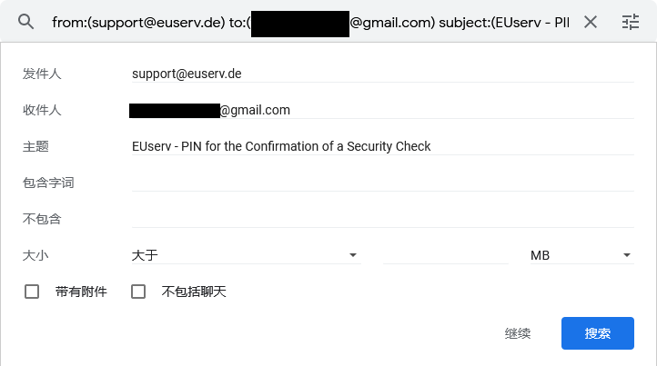

- 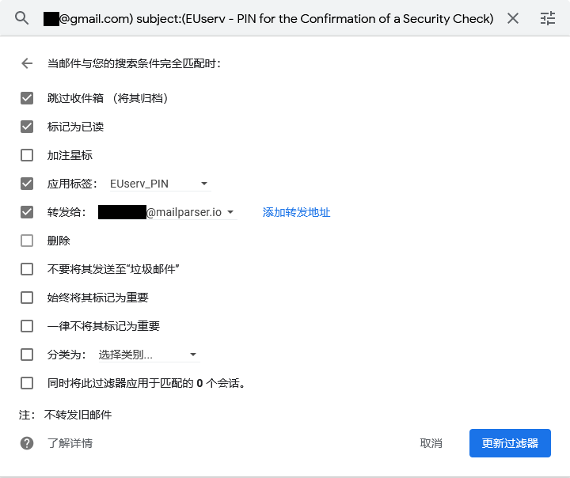

- 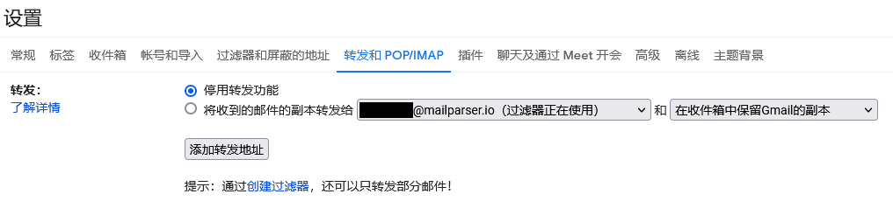

### Mailparser settings

- Create new inbox firstly.
- Create data parsing rules.
  - mailparser_data_parsing_rules
   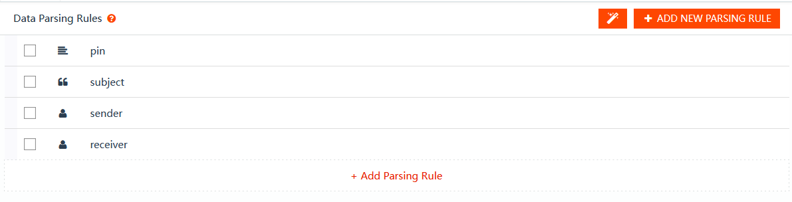
  - mailparser_data_parsing_rules_pin
  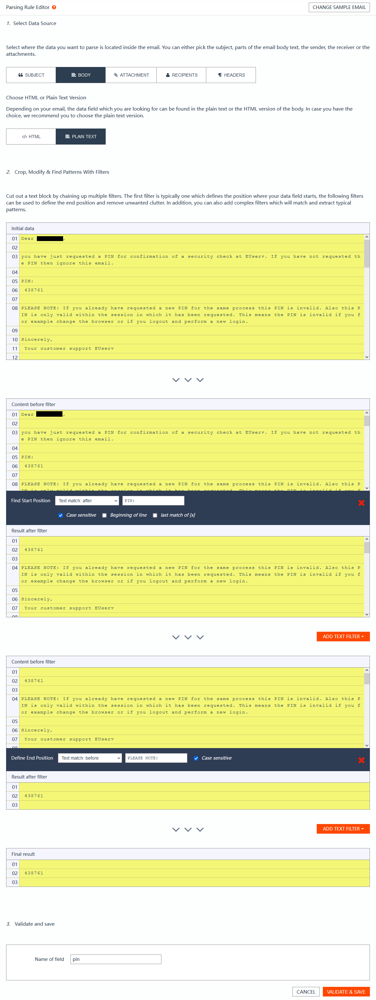
  - mailparser_data_parsing_rules_subject
  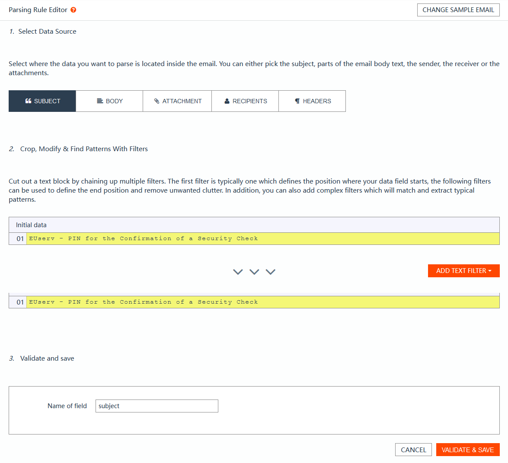
  - mailparser_data_parsing_rules_sender
  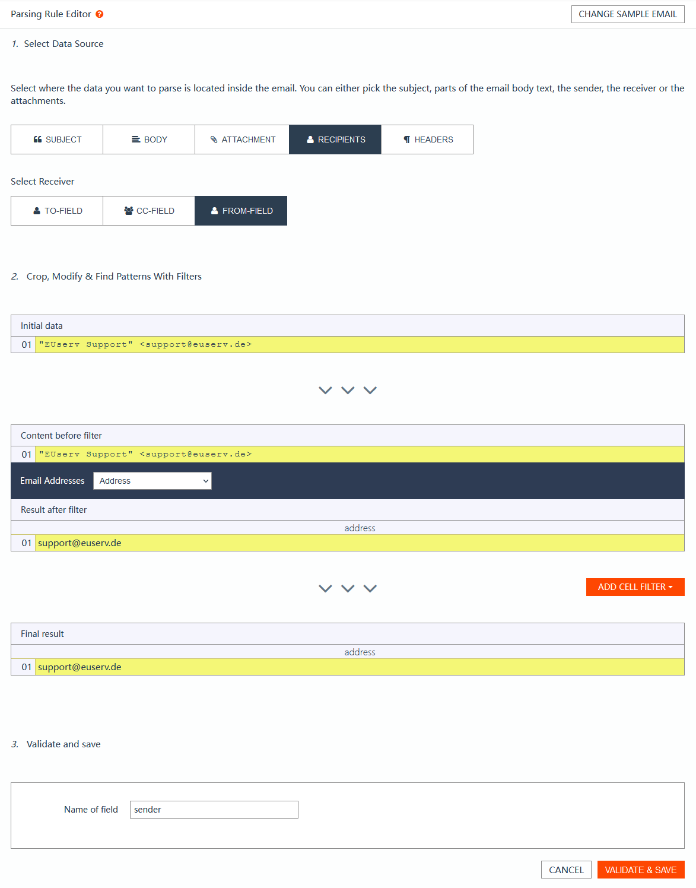
  - mailparser_data_parsing_rules_receiver
  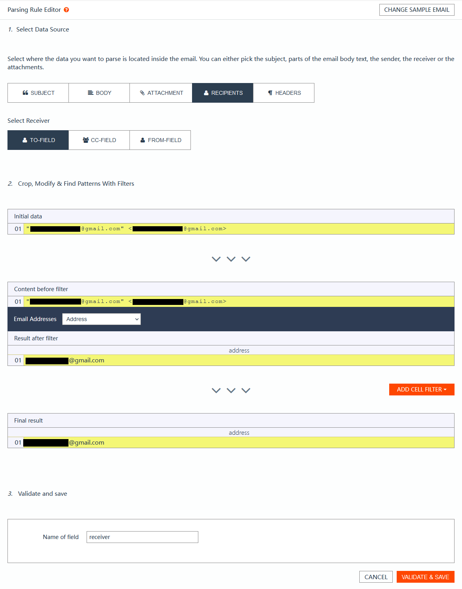
- Create parsed data download url
  - mailparser_parsed_data_downloads
  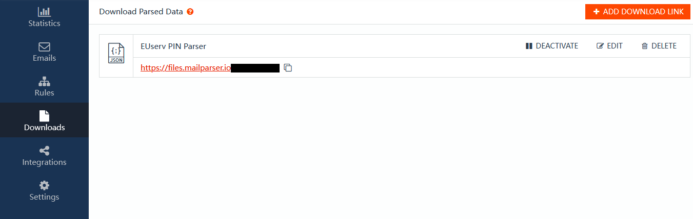
- mailparser_parsed_data_downloads_setting
  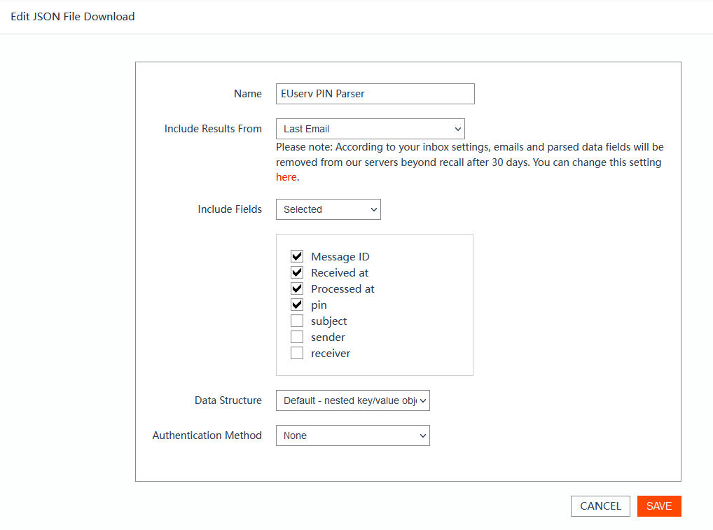
- Settings
  - mailparser_inbox_setting_1
  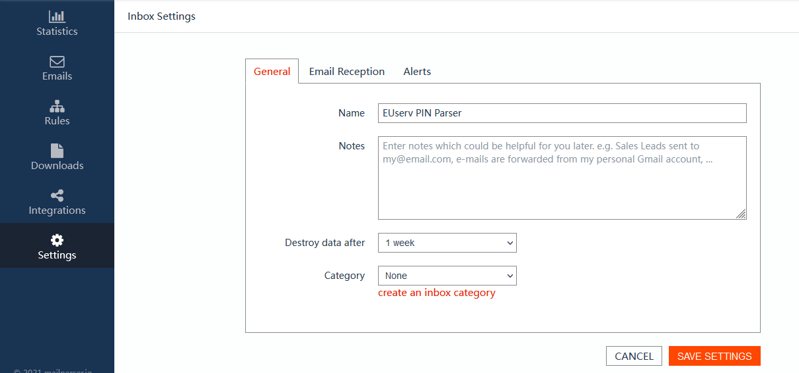
  - mailparser_inbox_setting_2
  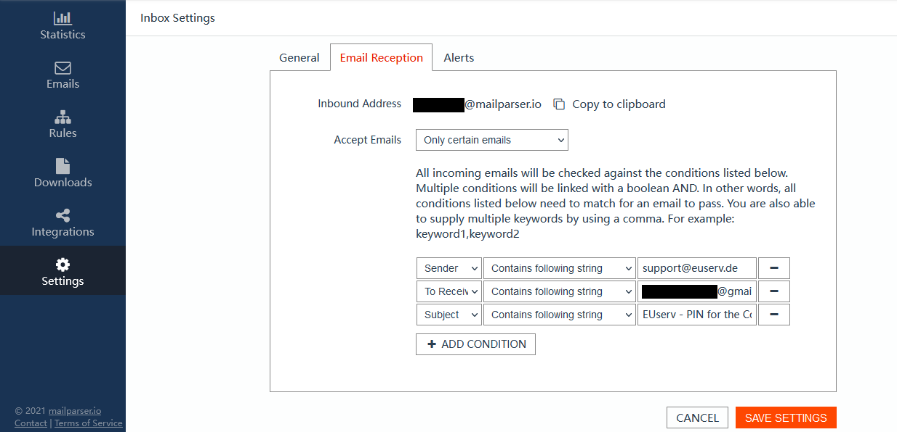

## TODO

- [ ] ~~Validate the `receiver` field parsed by mailparser to reduce malicious email interference.~~ Won't do due to mailparser *Inbox Settings - Email Reception*.

## Acknowledgement

Thanks EUserv provides us free IPv6 VPS for learning.

## References

### EUserv "PIN for the Confirmation of a Security Check" original mail

```
From：	     EUserv Support <support@euserv.de>
To：	         xyz@example.com
Subject：	 EUserv - PIN for the Confirmation of a Security Check
Content-Type: text/plain; charset = utf-8
Dear XYZ,

you have just requested a PIN for confirmation of a security check at EUserv. If you have not requested the PIN then ignore this email.

PIN:
123456

PLEASE NOTE: If you already have requested a new PIN for the same process this PIN is invalid. Also this PIN is only valid within the session in which it has been requested. This means the PIN is invalid if you for example change the browser or if you logout and perform a new login.


Sincerely,
Your customer support EUserv

--
Web ................: http://www.euserv.com
Login control panel.: https://support.euserv.com
FAQ ................: http://faq.euserv.com
Help & Guides.......: http://wiki.euserv.com
Community / Forum...: http://forum.euserv.com
Mailing-Liste ......: http://www.euserv.com/en/?show_contact=mailinglist
Twitter ............: http://twitter.com/euservhosting
Facebook ...........: http://www.facebook.com/euservhosting
--

EUserv Internet
is a division of
ISPpro Internet KG

Postal address:
ISPpro Internet KG
Division EUserv Internet
P.O. Box 2224
07622 Hermsdorf
GERMANY

Support-Phone: +49 (0) 3641 3101011 (English speaking)

Administration:
ISPpro Internet KG
Neue Str. 4
D-07639 Bad Klosterlausnitz
GERMANY

Management...............: Dirk Seidel
Register.................: AG Jena, HRA 202638
VAT Number...............: 162/156/36600
Tax office ..............: Jena
International VAT Number.: DE813856317
```

